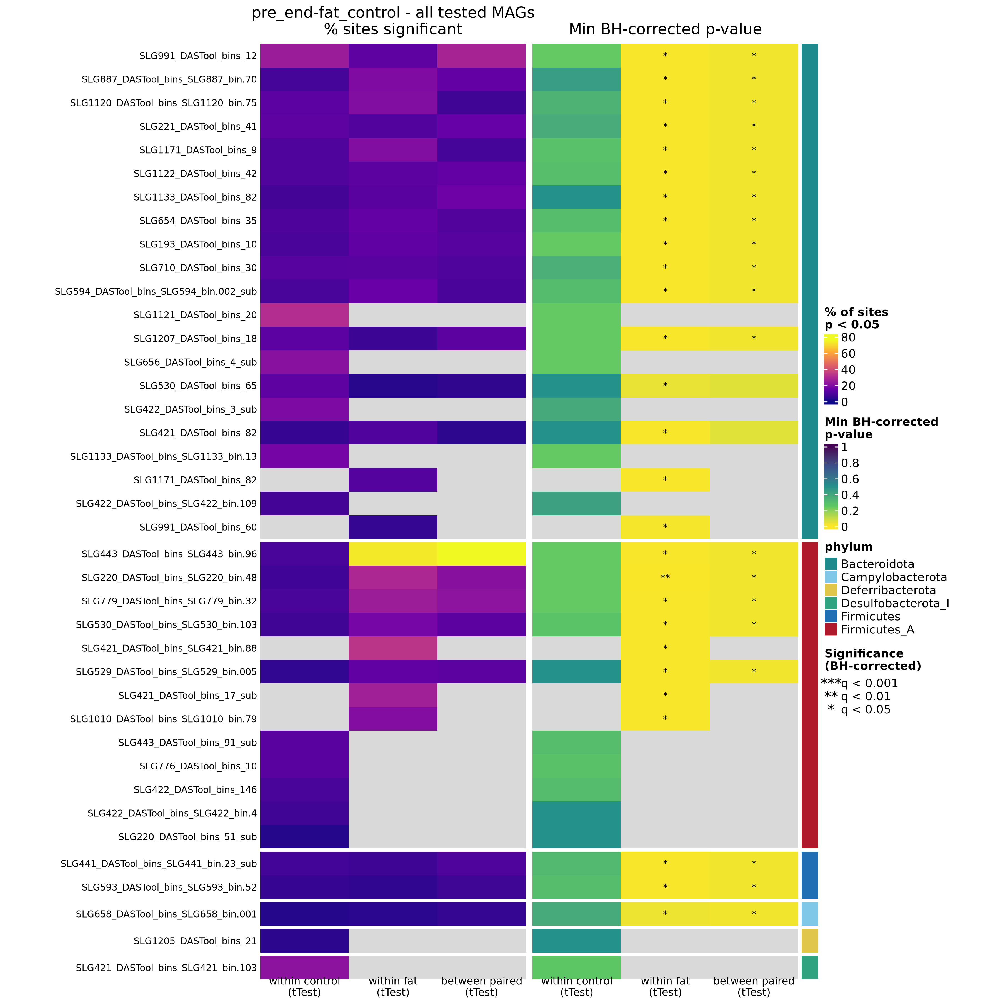

# AlleleFlux p-value heatmap — pre vs end, HF vs LF (breadth ≥ 0.5, coverage ≥ 1)

Per-MAG heatmap of AlleleFlux significance for the `pre_end` comparison between the
high-fat (`fat`) and control (`control`) diet groups, from an AlleleFlux run with
stricter QC than the main-text run: coverage breadth ≥ 0.5 and mean depth ≥ 1 per
MAG per sample (`quality_control:` in `alleleflux_config.yaml`), MAPQ ≥ 20.

- **`pvalue_heatmap_pre_end.qmd`** — Quarto (R) notebook that draws the two-panel
  heatmap: left = % of a MAG's tested sites significant at raw p < 0.05, right =
  the smallest BH-corrected q per cell, with significance stars (`*` q < 0.05,
  `**` q < 0.01, `***` q < 0.001). Columns are the within-group t-test for each
  diet (parallelism) and the between-group paired t-test (divergence). Rows are
  all tested MAGs, grouped and colour-barred by GTDB phylum; grey = not tested.
- **`figures/pvalue_heatmap_pre_end-fat_control.png`** — the rendered figure (300 dpi).

## Configuration Files

- **`alleleflux_config.yaml`** — the AlleleFlux configuration that produced the
  run, copied unchanged. It enables more modules than this figure uses (LMM, CMH,
  dN/dS, regional contrast, gene scores); only the `single_sample_tTest` and
  `two_sample_paired_tTest` p-value summaries feed the heatmap.
- **`run_alleleflux.sh`** — the SLURM submission script used to launch the run,
  copied unchanged (its paths are those of the original run and are cluster-specific).

No permutation (null) run is needed for this figure: the stars come from BH-corrected
q-values computed within the real run.

## Workflow

1. Reads `significant_sites_mag_cell_stats_long.tsv`, the per-(period, group pair,
   test, group, MAG) rollup written by the pipeline's `significant_sites_summary`
   step (one row per heatmap cell: sites tested, sites significant at p and at q,
   and the minimum p and q).
2. Keeps `period == "pre_end"`, `group_pair == "fat_control"` and the two t-test
   `test_type`s, then pivots to MAG × test matrices for `pct_sig_p` and `min_q_value`.
3. Looks up each MAG's phylum in the GTDB-Tk summary; rows are split by phylum and,
   within a phylum, ordered by total % significant.
4. Draws the two panels with ComplexHeatmap and writes the PNG to `figures/`.
